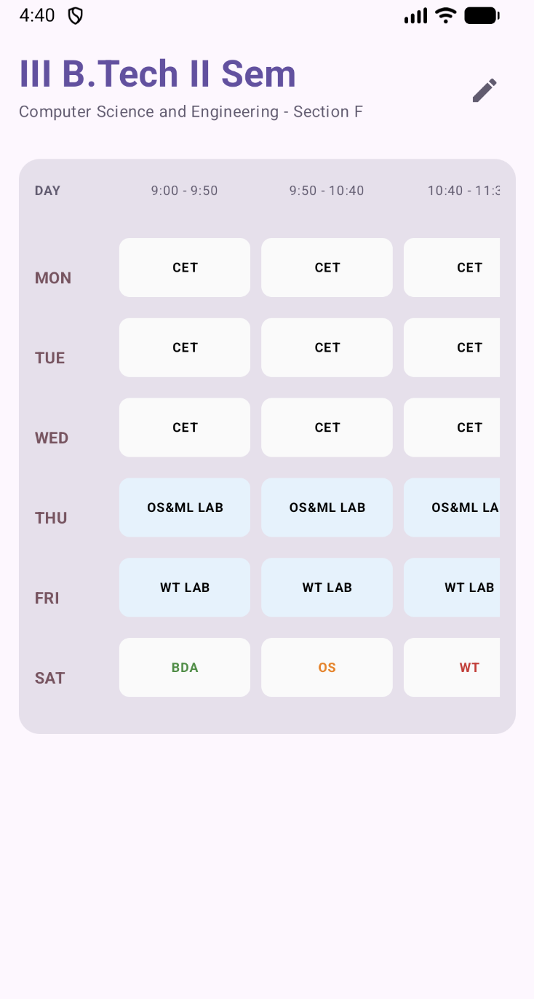
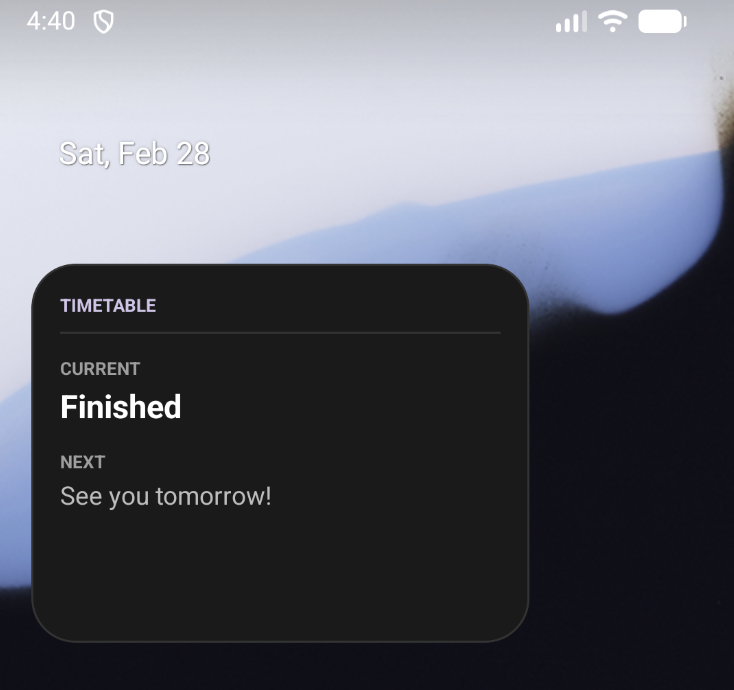

# Timetable Widget App

A simple and elegant Android application to manage your weekly timetable with a home screen widget that shows your current and next periods.

## Features
- **Home Screen Widget**: Stay updated with your current and next subjects directly from your home screen.
- **Interactive Timetable**: View your entire week's schedule in a synchronized, scrollable table.
- **Easy Editing**: Tap on any cell in the timetable to edit the subject.
- **Automatic Dark/Light Mode**: The app UI adapts to your system theme settings.
- **Material 3 Design**: Built with modern Jetpack Compose and Material 3 components.

## Screenshots

| Main Screen | Widget View |
|:---:|:---:|
|  |  |

## Getting Started
1. Clone the repository.
2. Open the project in Android Studio.
3. Build and run the app on your device or emulator.
4. Add the "Timetable Widget" to your home screen.

## Technologies Used
- **Kotlin**: Primary programming language.
- **Jetpack Compose**: For building the modern UI.
- **Material 3**: For styling and design system.
- **AppWidgets**: For the home screen widget functionality.
- **SharedPreferences**: For persistent storage of the timetable data.

## Author
Kotaratnakar
